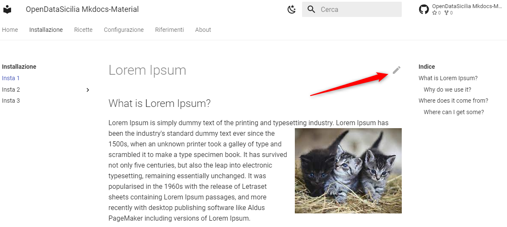

---
hide:
  - navigation
og_image: immagineCondivisioneAssociataPagina.png
---

## Come aggiungere icona "modifica pagina"

È possibile aggiungere un'icona che - in dipendenza dei permessi che si hanno sul repo - consente o di fare una modifica diretta sui contenuti della pagina o di proporne una (vedi immagine sotto).



Per farlo bisogna aprire il file di configurazione presente nella radice del *repository*, ovvero `mkdocs.yml`, e aggiungere l'URL del *repository* e l'URL di modifica.<br>
Quest'ultimo in un repository standard è `edit/main/docs/` (`main` è il nome standard del *branch* su GitHub).

```yaml
repo_url: https://github.com/opendatasicilia/ods-mkdocs-material
edit_uri: edit/main/docs/
```


## Come nascondere la sidebar di sinistra

Per certe sezioni, può essere intutile avere la *sidebar* di sinitra, perché non sono presenti altre sezioni "sorelle", ma ad esempio una sola lunga pagina.

Per nasconderla, basta aggiungere all'inizio del file:

```
---
hide:
  - navigation
---
```

## Come abilitare e/o disabilitare i commenti Disqus

È possibile abilitare i commenti di Disqus su tutte le pagine del sito ad eccezione della homepage


Per prima cosa dobbiamo verificare se nel `mkdocs.yml` è impostato correttamente il `site_url`, solitamente troviamo il `site_url` nella sezione *Project information*

Esempio di blocco Project information:

```yaml
## Project information
site_name: OpenDataSicilia Mkdocs-Material
site_url: https://opendatasicilia.github.io/ods-mkdocs-material/
site_description: OpenDataSicilia Mkdocs-Material repo demo
```

Per abilitare i commenti di Disqus bisogna aprire il file di configurazione presente nella radice del *repository*, ovvero `mkdocs.yml`, e aggiungere nella sezione *extra:* il seguente codice:

```yaml
extra:
  disqus: <shortname>
```

Esempio:

```yaml
extra:
   disqus: ods-mkdocs-material
```

Cosa è uno *shortname*?
Uno *shortname* è l'identificatore univoco assegnato a un sito Disqus. Tutti i commenti pubblicati su un sito sono referenziati con il nome breve. Segui la [guida di Disqus](https://help.disqus.com/en/articles/1717111-what-s-a-shortname) per assegare al tuo sito uno *[shortname](https://help.disqus.com/en/articles/1717111-what-s-a-shortname)*

Per alcune pagine può essere utile disabilitare commenti, per farlo basta aggiungere all'inizio del file:

```
---
disqus: ""
---
```

## Come aggiungere il repository di riferimento in alto a destra

Basta inserire nel file `mkdocs.yml`:

```
## Repository
repo_name: OpenDataSicilia Mkdocs-Material
repo_url: https://github.com/opendatasicilia/ods-mkdocs-material
```

E si otterrà


Altrimenti può essere inserito tra le icone con gli URL utili, presenti nel footer (vedi sotto).

## Come aggiungere icone con URL utili nel footer

Basta inserire nel file `mkdocs.yml`:

```yaml
extra:
 social:
    - icon: fontawesome/brands/twitter
      link: https://twitter.com/opendatasicilia
      name: account twitter
    - icon: fontawesome/brands/facebook
      link: https://www.facebook.com/groups/opendatasicilia
      name: gruppo facebook
    - icon: fontawesome/brands/github
      link: https://github.com/opendatasicilia/ods-mkdocs-material
      name: Repoisitory GitHub
    - icon: fontawesome/solid/rss
      link: ../feed_rss_created.xml
      name: Feed RSS
```


Nel sito si avrà qualcosa come quella sottostante:


## Come impostare titolo personalizzato per la condivisione sul web

Si fa aggiungendo a inizio pagina, nel così detto `front matter`, il titolo che si vuole associare alla pagina.

```
---
title: "Titolo personalizzato"
---
```

In questo modo, quando la pagina sarà condivisa online (*social*, chat, ecc.), il titolo sarà quello impostato:


## Come impostare immagine personalizzata per la condivisione sul web

Si fa aggiungendo a inizio pagina, nel così detto `front matter`, il nome del file immagine, che si vuole associare alla pagina.

```
---
og_image: immagineCondivisioneAssociataPagina.png
---
```

!!! note "Nota bene"

    Se cloni questo *repository* per creare il tuo sito, l'immagine dovrà essere inserita nella cartella `docs/img`.


In questo modo, quando la pagina sarà condivisa online (*social*, chat, ecc.), l'immagine di anteprima sarà quella scelta:


## Come aggiungere annotazioni nei blocchi di codice
Le annotazioni di codice offrono un modo comodo e intuitivo per aggiungere contenuto arbitrario a sezioni specifiche di blocchi di codice aggiungendo marcatori numerici nel blocco e commenti in linea nel blocco di codice

[Riferimento alla pagina del tutorial MKDocs-Material](https://squidfunk.github.io/mkdocs-material/reference/code-blocks/#adding-annotations).

Cosa fare:

Aggiungere le seguenti linee al file `mkdocs.yml`:
```
markdown_extensions:
  - pymdownx.highlight
  - pymdownx.inlinehilite
  - pymdownx.superfences
  - pymdownx.snippets
```

 Aggiungere questa istruzione segue al file `mkdocs.yml`:
 ```
 theme:
  features:
    - content.code.annotate
 ```

Vediamo qual è il risultato. Inseriamo nel seguente blocco di codice un commento che sarà preceduto dal simbolo cancelletto `#` e dal numero dentro parentesi tonda. Dopo aver chiuso il blocco di codice lasciare una riga vuota e inserire il commento:

```` markdown
``` yaml
theme:
  features:
    - content.code.annotate # (1)
```

1.  :man_raising_hand: I'm a code annotation! I can contain `code`, __formatted
    text__, images, ... basically anything that can be expressed in Markdown.
````

Il risultato è:

``` yaml
theme:
  features:
    - content.code.annotate # (1)
```

1.  :man_raising_hand: I'm a code annotation! I can contain `code`, __formatted
    text__, images, ... basically anything that can be expressed in Markdown.


## Come inserire in blocchi di codice sintassi Jinja

`Jinja` è il motore dei [template/temi di MkDocs](https://www.mkdocs.org/dev-guide/themes/). Per questa ragione se si inserisce del codice Jinja nei file Markdown, anche dentro blocchi di codice si hanno risultati inattesi.

Per fare in modo che non venga interpretato, bisogna fare l'escape, in [uno dei modi indicati qui](https://jinja.palletsprojects.com/en/3.0.x/templates/#escaping). Uno è circondare il tutto con `{{ '{{' }}% raw %{{ '}}' }}` e `{{ '{{' }}% endraw %{{ '}}' }}`, ovvero scrivendo il seguente codice nei file markdown

```` html
``` html
{{ '{{' }}% raw %{{ '}}' }}

{{ '{{' }}% extends "base.html" %{{ '}}' }}

{{ '{{' }}% block announce %{{ '}}' }}
  <!-- Add announcement here, including arbitrary HTML -->
{{ '{{' }}% endblock %{{ '}}' }}

{{ '{{' }}% endraw %{{ '}}' }}
```
````

si ottiene

``` html





  <!-- Add announcement here, including arbitrary HTML -->



```
